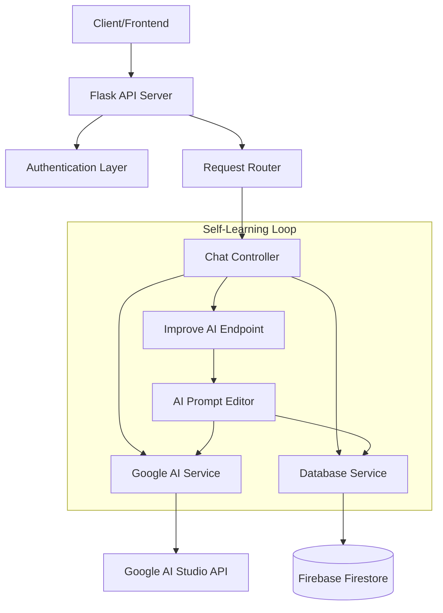
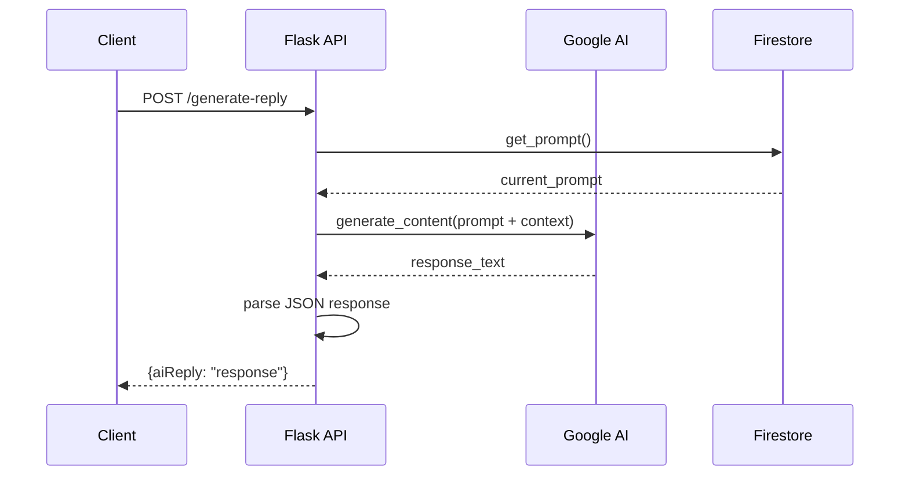
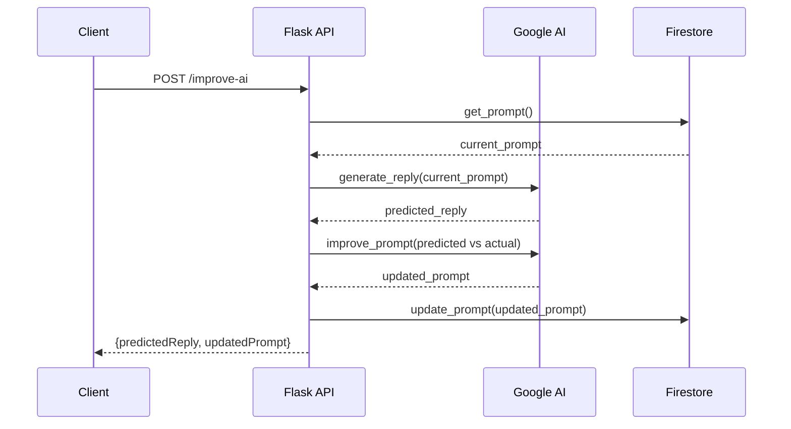
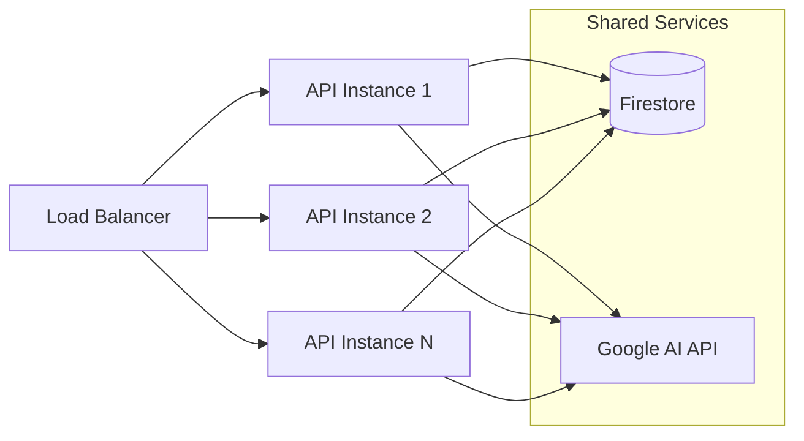
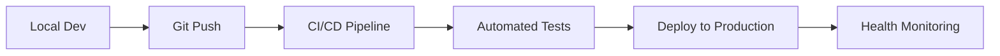

# Visa QA Chatbot - Architecture Design

## Overview
A self-learning AI assistant for visa consultation that provides human-like responses and improves over time through machine learning feedback loops.

## System Architecture



## Components

### 1. API Layer (Flask)
**File**: `app.py`
- **Purpose**: Web server and request routing
- **Technology**: Flask 3.1.0
- **Responsibilities**:
  - Initialize database connection
  - Register blueprints (controllers)
  - Handle HTTP requests/responses
  - Error handling and logging

### 2. Controllers
**File**: `controllers/chat_controller.py`
- **Purpose**: HTTP request handling and business logic coordination
- **Endpoints**:
  - `POST /generate-reply` - Generate AI responses
  - `POST /improve-ai` - Automatic prompt improvement
  - `POST /improve-ai-manually` - Manual prompt updates
- **Responsibilities**:
  - Request validation
  - Response formatting
  - Error handling
  - Service orchestration

### 3. AI Service Layer
**File**: `services/google_ai_service.py`
- **Purpose**: Google AI Studio integration and response generation
- **Technology**: Google Generative AI SDK
- **Key Methods**:
  - `generate_reply()` - Create human-like responses
  - `improve_prompt()` - Self-learning prompt optimization
  - `manual_improve_prompt()` - Manual prompt updates
- **Features**:
  - JSON response parsing with fallback
  - Error handling and retries
  - Prompt template management

### 4. Database Service Layer
**File**: `services/database_service.py`
- **Purpose**: Data persistence and prompt management
- **Technology**: Firebase Firestore
- **Key Methods**:
  - `get_prompt()` - Retrieve current AI prompt
  - `update_prompt()` - Store improved prompts
  - `init_database()` - Initialize connection
  - `upload_conversation_to_firestore()` - Sample data ingestion
- **Collections**:
  - `ai_config` - Store prompts and configuration
  - `conversations` - Sample conversation data

### 5. Configuration Management
**File**: `config.py`
- **Purpose**: Environment variable management
- **Technology**: python-dotenv
- **Settings**:
  - Google AI API credentials
  - Firebase configuration
  - Server port and environment

## Data Flow

### 1. Response Generation Flow


### 2. Self-Learning Flow


## Key Design Patterns

### 1. Service Layer Pattern
- **Separation of Concerns**: Business logic separated from HTTP handling
- **Dependency Injection**: Services injected into controllers
- **Interface Segregation**: Each service has single responsibility

### 2. Repository Pattern
- **Data Access Abstraction**: Database operations encapsulated
- **Configuration Management**: Environment-based settings
- **Connection Management**: Centralized database initialization

### 3. Error Handling Strategy
- **Graceful Degradation**: Fallback responses on AI failures
- **Comprehensive Logging**: Debug information for troubleshooting
- **User-Friendly Errors**: Clear error messages in responses

## Security Considerations

### 1. API Key Management
- **Environment Variables**: Sensitive data in `.env` file
- **No Hardcoded Secrets**: Configuration externalized
- **Git Protection**: `.env` in `.gitignore`

### 2. Input Validation
- **Request Schema**: JSON structure validation
- **Sanitization**: Input cleaning and validation
- **Error Boundaries**: Proper HTTP status codes

### 3. Rate Limiting (Future Enhancement)
- **API Quotas**: Prevent abuse of Google AI API
- **Request Throttling**: Fair usage policies
- **Circuit Breaker**: Fail-fast on service outages

## Scalability Architecture

### 1. Horizontal Scaling


### 2. Caching Strategy (Future Enhancement)
- **Response Caching**: Cache common queries
- **Prompt Caching**: Reduce database calls
- **Session Management**: Conversation state persistence

## Technology Stack

### Backend
- **Runtime**: Python 3.14
- **Framework**: Flask 3.1.0
- **AI Service**: Google Generative AI 0.8.3
- **Database**: Firebase Admin 6.5.0
- **Environment**: python-dotenv 1.1.0

### Deployment
- **Containerization**: Docker (recommended)
- **Platform**: Render/Railway/Fly.io
- **Environment**: Production/Development configs
- **Monitoring**: Health check endpoints

## Development Workflow

### 1. Local Development
```bash
# Setup
python -m venv venv
source venv/bin/activate
pip install -r requirements.txt

# Development Server
python app.py  # Runs on http://localhost:3032
```

### 2. Testing Strategy
- **Unit Tests**: Service layer testing
- **Integration Tests**: API endpoint testing
- **Manual Testing**: Postman collection
- **Load Testing**: Performance validation

### 3. Deployment Pipeline


## Future Enhancements

### 1. Advanced Features
- **Conversation Analytics**: Pattern recognition in queries
- **Customer Segmentation**: High-interest user identification
- **Multi-Language Support**: International visa consultations
- **Document Generation**: Automated visa document preparation

### 2. Performance Optimizations
- **Async Processing**: Non-blocking AI calls
- **Connection Pooling**: Database connection reuse
- **Response Compression**: Faster API responses
- **CDN Integration**: Static asset delivery

### 3. Monitoring & Observability
- **Metrics Collection**: Response times, success rates
- **Error Tracking**: Comprehensive error logging
- **Health Checks**: Service availability monitoring
- **Alerting**: Proactive issue notification

## Conclusion

This architecture provides a solid foundation for a self-learning visa consultation system that can scale horizontally while maintaining human-like conversation quality. The modular design allows for easy enhancement and maintenance, with clear separation of concerns and robust error handling throughout the system.
